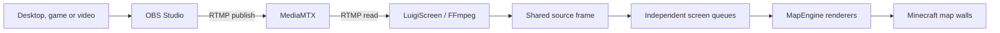

# How It Works

LuigiScreen is the final part of a small video pipeline.

## Component responsibilities

### OBS Studio

Captures and encodes the source into H.264 video. OBS publishes the stream but does not communicate with Minecraft directly.

### MediaMTX

Accepts the published RTMP stream and makes it available to readers. The generated configuration gives OBS publish-only access and, for external hosting, gives LuigiScreen a separate read-only account.

### FFmpeg and JavaCV

LuigiScreen uses bundled native FFmpeg libraries to decode video frames. The current artifact includes Windows x64 and Linux x64 natives.

### Shared source and latest-frame queues

One decoder exists per unique RTMP URL. Its reference-counted latest frame is
offered to every enabled screen in that source group without copying the
decoded image for each clone.

Each screen has its own one-frame queue and render pacing. If decoding is
faster than that screen's FPS, an older queued frame is replaced instead of
building latency.

### MapEngine

Creates the client-side map display and sends map updates to nearby players.

## Main-thread safety

RTMP decoding runs on a dedicated worker thread. Map frame preparation runs on a separate scheduled executor. Bukkit player and screen lifecycle operations are coordinated with the server thread.

## Viewer pause

By default, an RTMP decoder disconnects when no players are within the
individual distance of any enabled screen using that source. When a viewer
returns to any clone, LuigiScreen reconnects the shared source.

This saves CPU but means the first returning viewer sees a short reconnect delay.

## Offline frames

Instead of leaving a frozen video frame, LuigiScreen can show states such as:

- Connecting
- Waiting for stream
- Stream offline
- Stream stopped

## Screen persistence

Every screen's URL, FPS, distance, world, location, dimensions, facing and
enabled state are stored under `screens` in `config.yml`. LuigiScreen recreates
all valid screens after a normal restart.
