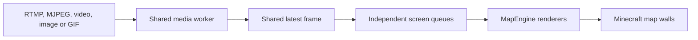
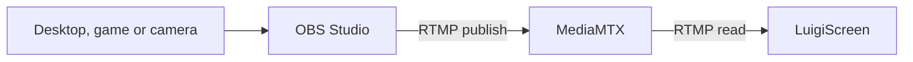

# How It Works

LuigiScreen separates media loading from Minecraft screen rendering.

## Media workers

RTMP, MJPEG, local videos and GIFs use FFmpeg through JavaCV. Local and URL
images use the Java image loader.

The current artifact includes Windows x64 and Linux x64 FFmpeg natives.

## Optional RTMP pipeline

OBS and MediaMTX are only part of the RTMP setup:

OBS captures and encodes video. MediaMTX receives it and provides a reader
endpoint. LuigiScreen does not communicate with OBS directly.

## Shared source and latest-frame queues

One worker exists per unique normalized source type and value. Its
reference-counted latest frame is offered to every enabled screen in that
source group without copying the decoded image for each clone.

Each screen has its own one-frame queue and render pacing. If loading or
decoding is faster than that screen's FPS, an older queued frame is replaced
instead of building latency.

## MapEngine

MapEngine creates the client-side map display and sends map updates to nearby
players.

## Main-thread safety

Media loading and decoding run on dedicated worker threads. Map frame
preparation runs on a separate scheduled executor. Bukkit player and screen
lifecycle operations are coordinated with the server thread.

## Viewer pause

By default, an FFmpeg worker disconnects when no players are within the
individual distance of any enabled screen using that source. When a viewer
returns to any clone, LuigiScreen reconnects or reopens the source.

Static images keep their loaded frame and do not continuously decode.

## Offline frames

Instead of leaving a frozen video frame, LuigiScreen can show states such as:

- Connecting
- Loading source
- Waiting for source
- Source offline
- Source stopped

## Screen persistence

Every screen's source type, source value, FPS, distance, world, location,
dimensions, facing and enabled state are stored under `screens` in
`config.yml`. LuigiScreen recreates all valid screens after a normal restart.
