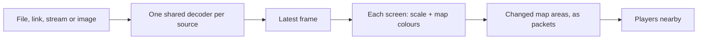

# How It Works

LuigiScreen keeps loading media and drawing screens apart.

```mermaid
flowchart LR
    A["File, link, stream or image"] --> B["One shared decoder per source"]
    B --> C["Latest frame"]
    C --> D["Each screen: scale + map colours"]
    D --> E["Changed map areas, as packets"]
    E --> F["Players nearby"]
```

## Decoding

Videos, GIFs, streams and links are decoded by FFmpeg (bundled through JavaCV).
Images use the Java image loader. YouTube, Twitch and other pages are first
turned into a direct stream address by yt-dlp, again on every reconnect,
because those addresses expire after a few hours.

FFmpeg scales each frame down to the largest screen that uses the source, so a
1080p video is never copied around at full size.

Screens with the same source (for example two clones showing `intro.mp4`)
share one decoder. Each screen then scales the shared frame to its own size
and FPS. If decoding is faster than a screen can draw, the older frame is
dropped instead of building delay.

## Drawing

Each screen is a wall of invisible item frames holding maps. They exist only
in packets: LuigiScreen sends them to players near the screen and removes them
when players walk away, so nothing is saved in the world or in map storage.

Pixels are converted to the Minecraft map palette of the running server
version. Optional dithering smooths gradients, and *colour stability* keeps a
pixel's previous colour while the new one is almost the same, which stops
video noise from forcing full map updates.

For every frame, only the changed rectangle of each map is sent, and all maps
of one frame travel in one bundle so the picture never tears. A player whose
connection is full skips frames and later receives exactly the maps they missed.

PacketEvents (bundled inside the JAR) translates the packets for each
Minecraft version, which is why one JAR serves 1.21.11 and 26.x.

## Pausing without viewers

A decoder stops when no player is within the viewing distance of any screen
that uses it, and reconnects when someone comes back. While Web Studio shows a
preview, decoding continues at the preview rate (about one frame per second).

## What the screen shows

Every screen has a **default source** saved in `config.yml`. On top of it:

1. **Emergency mode** — shows MAINTENANCE everywhere, blocks everything else.
2. **Event** — a temporary timeline (countdown, video, announcement…).
3. **Queue** — media started with `/screen play` or *Play…* in Web Studio.
4. **Playlist** — weighted rotation.
5. **Default source.**

When an item ends, the screen falls back to the next level down. While a
source connects or fails, the screen shows a short status card instead of a
frozen frame.

## Threads

Decoding, scaling and packet sending run on their own threads. Only Bukkit
work (player lookups, commands, playlist ticks) runs on the server thread, and
the server thread never waits for FFmpeg to close.
