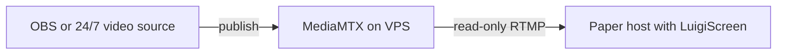

# External Hosting and 24/7

Use this setup when MediaMTX runs on a public VPS or another external machine.

It is the recommended architecture for managed Minecraft hosts such as Minekeep.



## Generate configuration

On the Minecraft server run:

```text
/screen mediamtx hosting
```

Enter:

1. The public IP or DNS hostname of the MediaMTX VPS
2. The external MediaMTX TCP port, or `default` for `55556`

## Move the generated config

Download:

```text
plugins/LuigiScreen/mediamtx/HOSTING/mediamtx.yml
```

Upload it to the VPS beside MediaMTX.

Restart MediaMTX and allow inbound TCP `55556` in the VPS firewall and provider firewall.

## Why hosting uses two accounts

The generated configuration creates:

- `streamer`: publish-only access for OBS
- `luigiscreen`: read-only access for the Minecraft plugin

Compromising one URL does not automatically grant both permissions.

## Can it run without your home PC?

MediaMTX can run without your home PC, but a video source must still publish content.

Options:

### Live desktop

OBS must run on the computer whose screen is captured. Turning off that computer ends the live source.

### Looping video on the VPS

Install FFmpeg on the VPS and publish a video repeatedly:

```bash
ffmpeg -re -stream_loop -1 -i video.mp4 -c copy -f flv "RTMP_PUBLISH_URL"
```

The file must contain codecs compatible with RTMP, normally H.264 video and AAC audio. Re-encode it first if stream copy fails.

### MediaMTX always-available mode

Recent MediaMTX releases can provide an offline segment when the publisher disconnects. This keeps readers connected but does not preserve the last live desktop.

## VPS sizing

MediaMTX itself is lightweight when it only forwards one stream. A small x86_64 Linux VPS is usually sufficient.

FFmpeg transcoding needs substantially more CPU. Prefer stream copy or pre-encode the looping file.

## Minekeep notes

- Use LuigiScreen `1.1.0-alpha.7` or newer for Linux x86_64.
- Do not use `same-pc` unless MediaMTX actually runs inside the same hosting container.
- The Minecraft host needs outbound TCP access to the VPS.
- The VPS, not Minekeep, needs the public inbound RTMP port.
