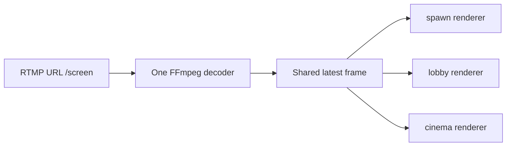

# Multiple Screens and Clones

LuigiScreen alpha.8 supports multiple named screens.

## Independent screen settings

Every screen keeps its own URL, FPS, viewer distance, world, location, width,
height and enabled state.

```text
/screen create spawn 7 4
/screen create shop 4 3
```

The screens may be in different worlds and use different RTMP streams.

## Clone an existing screen

Look at the upper-left block for the new display and run:

```text
/screen clone spawn lobby
```

The new screen copies the source URL, dimensions, FPS, distance and enabled
state. Its world, location and facing come from the new wall.

## Shared decoding

LuigiScreen groups screens by their exact trimmed URL:



This means three clones do not start three FFmpeg decoders. Each screen still
performs its own MapEngine scaling and packet rendering because its dimensions,
FPS and viewers may differ.

The shared decoder reads at the highest effective FPS required by its enabled
screens. A slower clone discards replaced pending frames rather than building
delay.

## Split a clone into another source

```text
/screen set lobby url rtmp://127.0.0.1:55556/second
```

`lobby` now gets its own source group. The original decoder continues if
another enabled screen still uses the original URL.

## Pause behavior

A shared decoder pauses only when no enabled screen in its group has a viewer
within that screen's own distance.

Disabling one clone does not interrupt other enabled clones:

```text
/screen stop lobby
/screen start lobby
```
