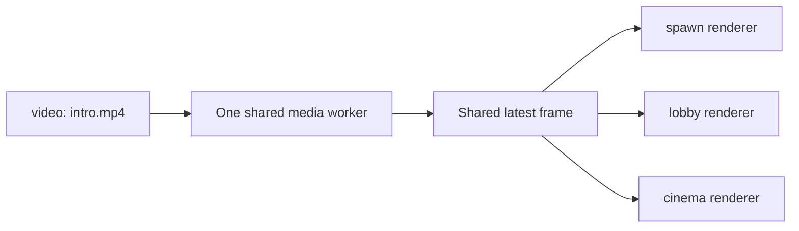

# Multiple Screens and Clones

LuigiScreen supports multiple named screens.

## Independent screen settings

Every screen keeps its own media source, FPS, viewer distance, world,
location, width, height, enabled state and visibility permission.

```text
/screen create spawn 7 4
/screen create shop 4 3
```

The screens may be in different worlds and use different source types.

## Clone an existing screen

Look at the upper-left block for the new display and run:

```text
/screen clone spawn lobby
```

The new screen copies the source type and value, dimensions, FPS, distance,
enabled state and visibility setting. Its world, location and facing come from
the new wall.

## Shared loading and decoding

LuigiScreen groups screens by their normalized source type and value:



Three clones do not start three FFmpeg decoders. Each screen still performs
its own MapEngine scaling and packet rendering because its dimensions, FPS and
viewers may differ.

The shared worker reads at the highest effective FPS required by its enabled
screens. A slower clone discards replaced pending frames rather than building
delay.

## Split a clone into another source

```text
/screen source lobby image lobby.png
```

`lobby` now gets its own source group. The original worker continues if
another enabled screen still uses the original source.

## Pause behavior

A shared FFmpeg worker pauses only when no enabled screen in its group has a
viewer within that screen's own distance.

Disabling one clone does not interrupt other enabled clones:

```text
/screen stop lobby
/screen start lobby
```
