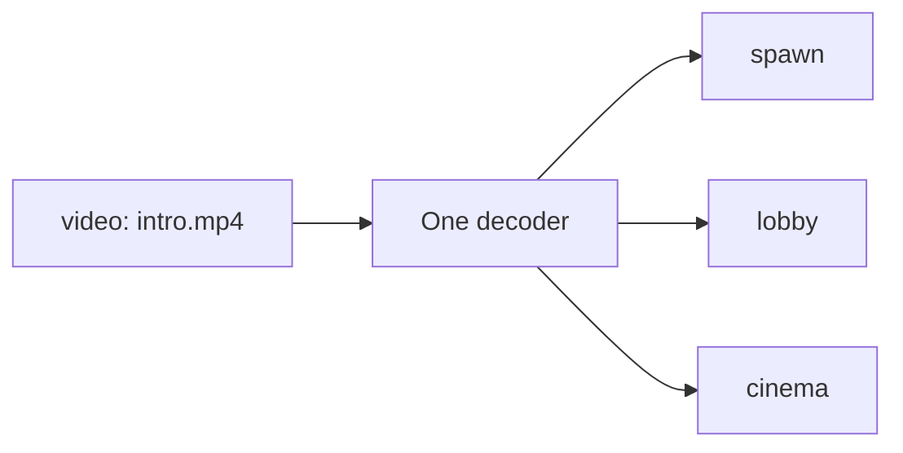

# Multiple Screens and Clones

Create as many named screens as you like, in any world:

```text
/screen create spawn 7 4
/screen create shop 4 3
```

Each keeps its own source, playlist, FPS, viewing distance and visibility.

## Clone a screen

Look at the top-left block of the new wall and run:

```text
/screen clone spawn lobby
```

The clone copies the source, size, FPS, distance and visibility of `spawn`.

## One decoder for many screens

Screens showing exactly the same source share one decoder:


```mermaid
flowchart LR
    A["video: intro.mp4"] --> B["One decoder"]
    B --> C["spawn"]
    B --> D["lobby"]
    B --> E["cinema"]
```

Each screen still scales the frame and sends map packets for its own size and
viewers. The decoder runs at the highest FPS any of its screens needs; slower
screens simply skip frames.

Give one clone something else and it gets its own decoder:

```text
/screen source lobby poster.png
```

## Control several screens at once

- `/screen on all` and `/screen off all`
- **Screen groups** in Web Studio → Program → Automations, then use the group
  buttons or target the group in an automation rule.
